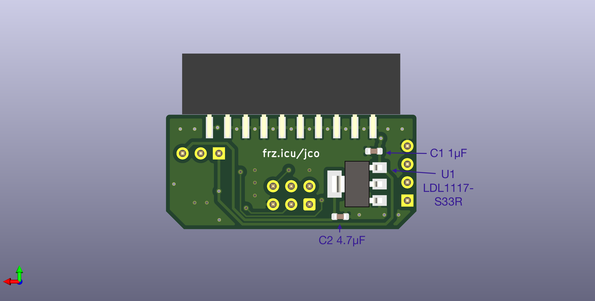
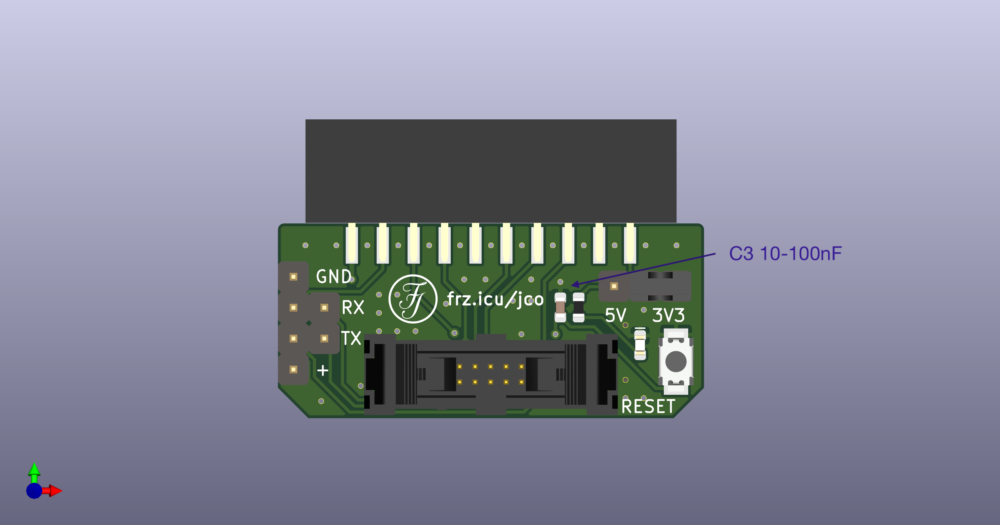
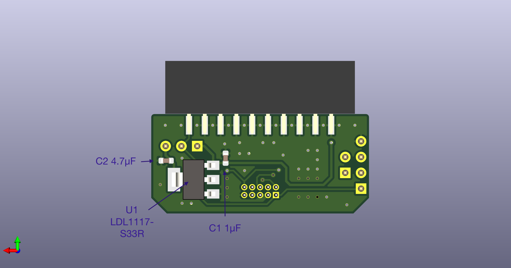

# J-Link Adapter Boards

20P JTAG to TAG-Connect TC2030 and  
20P JTAG to 10P JTAG (1.27mm) adapter boards.

### Features:
* 5V to 3.3V LDO and power good LED,
* button to reset the target device,
* VCOM breakout.

### PCB
The ideal PCB thickness would be 2.0mm, but 1.6mm is much cheaper and works as well.

## Tag-Connect Adapter

## 10P Adapter
A jumper can be added to connect RX and TX to the pins 7 and 8 respectively. (TX and RX are not in the standard 10P pinout!)  

 