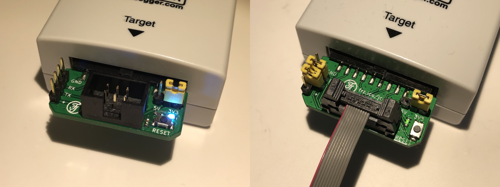
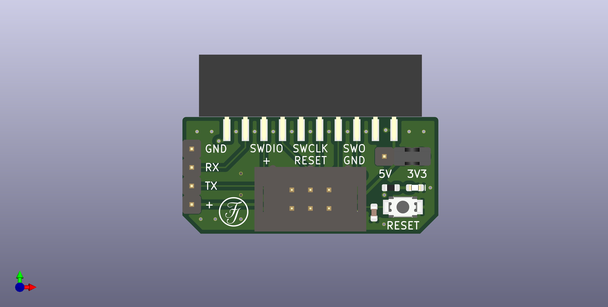
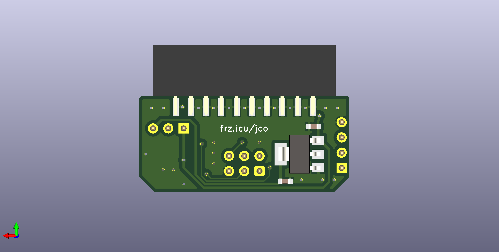

# J-Connect

20P JTAG-Connector to TAG-Connect TC2030 adapter board.  

### Features:
* 5V to 3.3V LDO and power good LED,
* button to reset the target device,
* VCOM breakout.

### PCB
The ideal PCB thickness would be 2.0mm, but 1.6mm is much cheaper and works as well.

